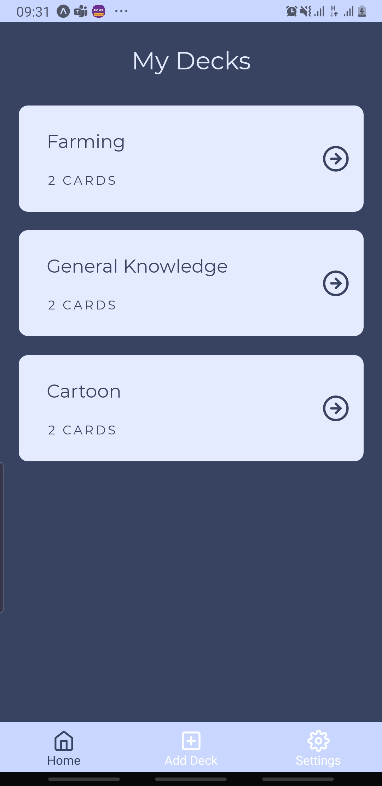
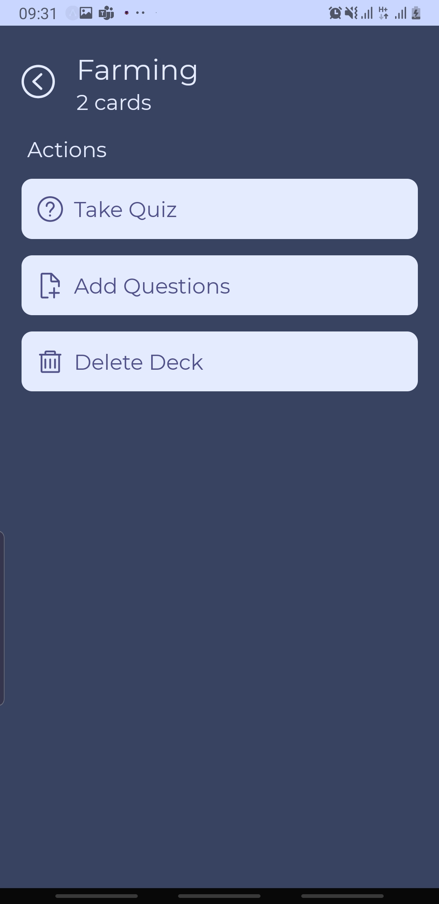
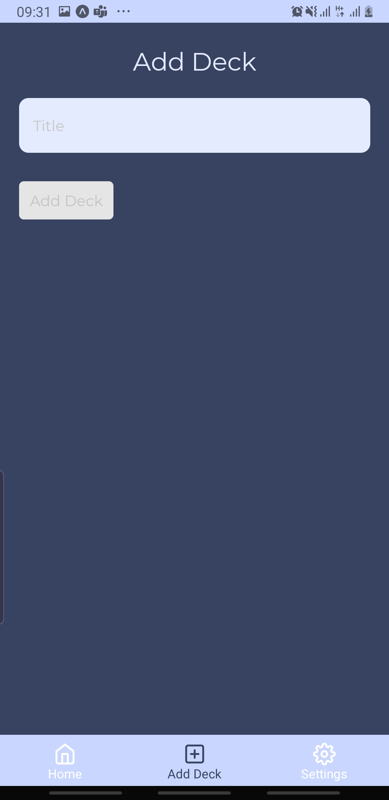

# Flashcards

Mobile Flashcards is a React Native app for iOS and Android that allows users to create decks, add cards and quiz themselves.






It uses React Native, Expo, Redux, & React Navigation.

This app is the third of three projects required for [Udacity's React Nanodegree program](https://www.udacity.com/course/react-nanodegree--nd019).

## Installation

Clone the repository, and use npm or yarn to install the dependencies.

```bash
$ git clone https://github.com/giselle2323/Flashcards.git
$ cd Flashcards
$ yarn install
```

## Usage

The project can be run with npm or yarn

- `yarn start`

This will open Expo Developer Tools in the browser.  You can then do one of the following.

- Use your device to test:

    Scan the QR Code using the Expo Client app ([Expo Client for Android & iOS](https://expo.io/tools#client))  from an Android or iOS device.
- Use an Android Emulator or iOS Simulator to run the app:
    - [iOS Simulator Setup](https://docs.expo.io/versions/v33.0.0/introduction/installation/#ios-simulator)
    - [Android Emulator Setup](https://docs.expo.io/versions/v33.0.0/introduction/installation/#android-emulator)

## Testing

This project has been tested on the following platforms:

- Android 9.
